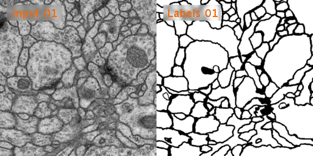

# keras-Unet

The implementation of biomedical image segmentation with the use of U-Net model with Keras and Jupyter Notebook. The architecture was inspired by [U-Net: Convolutional Networks for Biomedical Image Segmentation](http://lmb.informatik.uni-freiburg.de/people/ronneber/u-net/).

And I mainly referred to the images and codes of these github: [zhixuhao github](https://github.com/zhixuhao/unet) and [ugent-korea github](https://github.com/ugent-korea/pytorch-unet-segmentation)
## Abstract

The author of paper propose a simple and effective end-to-end image segmentation network architecture for medical images.
The proposed network, called U-net, has main three factors for well-training.
- U-shaped network structure with two configurations: Contracting and Expanding path
- Training more faster than sliding-windows: Patch units and Overlap-tile
- Data augmentation: Elastic deformation and Weight cross entropy

## Dataset

The dataset we used is Transmission Electron Microscopy (ssTEM) data set of the Drosophila first instar larva ventral nerve cord (VNC), which is dowloaded from [ISBI Challenge: Segmentation of of neural structures in EM stacks](http://brainiac2.mit.edu/isbi_challenge/home)


<p align="center">
    
</p>

- Black and white segmentation of membrane and cell with EM(Electron Microscopic) image.
- The data set is a large size of image and few so the data augmentation is needed.
- The data set contains 30 images of size 512x512 for the train, train-labels and test.
- There is no images for test-labels for the ISBI competition. 
- If you want to get the evaluation metrics of competition, you should split part of the train data set for testing.

## Overlap-tile

<p align="center">
 <br/>Sliding window</td>
</p>

<p align="center">
 <br/>Patch</td>
</p>


- Patch method has low overlap ratio so that the speed of detection can be improvement.
- However, as the wide size of patch detect image at once, the performance of context is good but the performance of localization is lower. 
- In this paper, the U-net architecture and overlap-tile methods were proposed to solve this localization problem.


<p align="center">
 <br/>Overlap-tile</td>
</p>


Simple. Because the EM image is large, sometimes the model of detection input is larger than the patch size (yellow). If so, mirror and fill in the patch area with the empty part.


## Data Augmenation

We preprocessed the images for data augmentation. Following preprocessing are :
   * Flip
   * Gaussian noise
   * Uniform noise
   * Brightness
   * Elastic deformation
   * Crop
   * Pad 

You can easily to understand refer this [page](https://github.com/ugent-korea/pytorch-unet-segmentation/blob/master/README.md#preprocessing)


<p align="center">
   <br />Original Image</td>
</p>

<table border=0 width="99%" >
	<tbody> 
    <tr>		<td width="99%" align="center" colspan="4"><strong>Image</td>
		</tr>
		<tr>
			<td width="19%" align="center"> Flip  </td> 
			<td width="27%" align="center">  <br />Vertical  </td> 
			<td width="27%" align="center">   <br />Horizontal</td>
			<td width="27%" align="center">  <br />Both</td>
		</tr>
      		</tr>
		<tr>
			<td width="19%" align="center"> Gaussian noise </td>
			<td width="27%" align="center">  <br />Standard Deviation: 10</td>
			<td width="27%" align="center">  <br />Standard Deviation: 50</td>
			<td width="27%" align="center">  <br />Standard Deviation: 100</td>
   		</tr>
		<tr>
			<td width="19%" align="center"> Uniform noise </td>
			<td width="27%" align="center">  <br />Intensity: 10 </td>
			<td width="27%" align="center">  <br />Intensity: 50</td>
			<td width="27%" align="center">  <br />Intensity: 100</td>
		</tr>
      		</tr>
		<tr>
			<td width="19%" align="center"> Brightness </td>
			<td width="27%" align="center">  <br />Intensity: 10</td>
			<td width="27%" align="center">  <br />Intensity: 20</td>
			<td width="27%" align="center">  <br />Intensity: 30</td>
		</tr>
      		</tr>
		<tr>
			<td width="19%" align="center"> Elastic deformation </td>
			<td width="27%" align="center">  <br />Random Deformation: 1</td>
			<td width="27%" align="center">  <br />Random Deformation: 2</td>
			<td width="27%" align="center">  <br />Random Deformation: 3</td>
		</tr>
		</tr>
	</tbody>
</table>       

### Crop and Pad
<table border=0 width="99%" >
	<tbody> 
    <tr>		<td width="99%" align="center" colspan="4"><strong>Crop</td>
	    </tr>
		<tr>
			<td width="25%" align="center">  <br />  Left Bottom </td>
			<td width="25%" align="center">  <br /> Left Top</td> 
			<td width="25%" align="center">  <br /> Right Bottom</td>
			<td width="25%" align="center">  <br /> Right Top</td> 
		</tr>
      		</tr>
	</tbody>
</table>         

Padding process is compulsory after the cropping process as the image has to fit the input size of the U-Net model. 

In terms of the padding method, **symmetric padding** was done in which the pad is the reflection of the vector mirrored along the edge of the array. We selected the symmetric padding over several other padding options because it reduces the loss the most. 

To help with observation, a  'yellow border' is added around the original image: outside the border indicates symmetric padding whereas inside indicates the original image.

<table border=0 width="99%" >
	<tbody> 
    <tr>		<td width="99%" align="center" colspan="4"><strong>Pad</td>
	    </tr>
		<tr>
			<td width="25%" align="center">  <br />  Left Bottom </td>
			<td width="25%" align="center">  <br /> Left Top</td> 
			<td width="25%" align="center">  <br /> Right bottom</td>
			<td width="25%" align="center">  <br /> Right Top</td> 
		</tr>
      		</tr>
	</tbody>
</table>         


## Network Architecture

<p align="center">
    
</p>


### Contracting Path (Fully Convolution)
- Typical convolutional network.
- 3x3 convolution layer with max-pooling and drop out
- Extracts the image feature accurately, but reduces the size of the image feature map.


### Expanding Path (Deconvolution)
- Output segmentation map by upsampling the feature map
- 2x2 up-convolution and 3x3 convolution layer with concatenation
- The disadvantage of upsampling process is that the localization information in the image feature map will be lost.
- Therefore, localization information less lost by concatenating the feature map after up-conv with the same level feature map.
- Last one is 1x1 convolution mapping

## Result

<table border=0 width="99%" >
	<tbody> 
    <tr>
	    </tr>
		<tr>
			<td width="50%" align="center">  <br />  Test Data</td>
			<td width="50%" align="center">  <br /> Prediction</td> 
		</tr>
      		</tr>
	</tbody>
</table>      

## Usage
When you download my code, your directory tree should consist of the following
```
keras-Unet/
├── data
    ├── test-volume.tif
    ├── train-labels.tif
    └── train-volume.tif
├── images
├── jupyter.ipynb
├── augmentation.py
├── model.py
├── preprocessing.py
├── README.md
├── train.py
├── utills.py
└── requirement.txt
```
You can change the root directory of data to change the *data_path* in pre-processing.py and augmentation.py 

However, at least three original competition data (test-volume, train-labels, train-volume) should put in the *data_path*


```bash
$ python3 augmentation.py
$ python3 preprocessing.py
$ python3 train.py
```

Easly to use my program just run augmentation-preprocessing-train step.
You can get the prediction.tif for the result.

And you can just run the **jupyter.ipynb** with [jupyter notebook](https://jupyter.org/) to see how U-net works. 